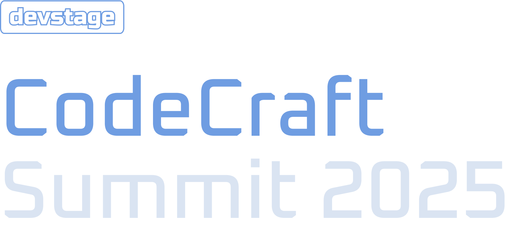

<p align="center">
  
  
  <h1 align="center">Project NLW Connect - DevStage</h1>

  <!-- <p align="center">
    🔗 <a href="https://URLThisProject.com">https://URLThisProject.com</a> 🔗
  </p>   -->

I developed an event project using React with Next.js, where users can register for the event and access a dedicated page to share their referral link. On this page, they can track the number of accesses generated by their link, the total referrals made, and their position in the ranking. Additionally, there is a section highlighting the top three participants with the most referrals.

</p>

## 🧭 Table of contents

- [🧭 Table of contents](#-table-of-contents)
- [🎥 Implementation Video](#-implementation-video)
- [🎨 Layout](#-layout)
- [👏 Learning and more Implementations](#-learning-and-more-implementations)
- [💡 Technologies Used](#-technologies-used)
- [🚀 Running the Project](#-running-the-project)
  - [Back-end](#back-end)
  - [Front-end Web](#front-end-web)
- [🌎 License](#-license)
- [✒ Author](#-author)

## 🎥 Implementation Video

In the GitHub edit, drag the video that it already puts on github itself.

## 🎨 Layout

Layout developed by [Milena Martins](https://www.linkedin.com/in/millenamartins/)

[](<https://www.figma.com/design/7CxqcSiQPpQh6xNWGkBrIN/NLW-Connect-%E2%80%A2-DevStage-(Community)?node-id=3243-1536&t=3uFIKsJYAFKHWfeM-1>)

## 👏 Learning and more Implementations

The main learning experience was installing [Tailwind CSS](https://tailwindcss.com/) version 4, which was recently released, and exploring its new configurations. Additionally, I used [Orval](https://orval.dev/), which automatically generates all queries and typings for the frontend based on the backend's OpenAPI documentation.

## 💡 Technologies Used

- [x] [React](https://reactjs.org/)
- [x] [Nextjs](https://nextjs.org/)
- [x] [TypeScript](https://www.typescriptlang.org/)
- [x] [Tailwind CSS](https://tailwindcss.com/)
- [x] [Lucide](https://lucide.dev/guide/packages/lucide-react)
- [x] [React Hook Form](https://www.react-hook-form.com/)
- [x] [Zod](https://zod.dev/)
- [x] [Orval](https://orval.dev/)

<!-- ## 📂 Folder Structure

```plainText
app
.
├── __tests__
├── android                     # Native android files
├── ios                         # Native ios files
├── src                         # Source files
│   ├── @types                  # Contains all global definitions of types and interfaces
│   ├── assets                  # Contains Js bundles assets. e.g: icons, splash, images etc...
│   ├── components              # Contains all global react components
│   ├── context                 # All contexts
│   ├── constants               # Constants files
│   ├── hooks                   # Cstomized hooks
│   ├── navigation
│   ├── screens
│   ├── services                # Contains external and api services
│   ├── App                     # Aplication entry
.
.
├── index                       # Bundle entry
.
.
└── README.md
``` -->

## 🚀 Running the Project

Clone the project

```bash
  git clone https://github.com/VagnerNerves/nlw-connect-react-022025.git
```

### Back-end

Enter the project directory

```bash
  cd server
```

Install with dependencies

```bash
  npm install
```

You will need to start Docker and run the following command to create the PostgreSQL database and Redis.

```bash
  docker compose up -d
```

Run the following command to create the database and tables.

```bash
  npm run db:migrate
```

Start the server

```bash
  npm run dev
```

### Front-end Web

Enter the project directory

```bash
  cd web
```

Install with dependencies

```bash
  npm install
```

Start the server

```bash
  npm run dev
```

<!-- ### Mobile

Clone the project

```bash
  git clone https://link-para-o-projeto
```

Enter the project directory

```bash
  cd my-project
```

Install with dependencies

```bash
  npm install
```

Start the server

```bash
  npx expo start
```

- IOS:

```bash
  npx pod-install && npx react-native run-ios
```

- Android:

```bash
  npx react-native run-android
```

## 📝 Routes

[](https://app.getpostman.com/run-collection/link)
[](https://insomnia.rest/run/?label=NAMEPROJECT&uri=LINK) -->

## 🌎 License

This project is under the MIT license. See the [LICENSE](https://github.com/VagnerNerves/nlw-connect-react-022025?tab=MIT-1-ov-file) file for more details.

## ✒ Author

<p align="center">
  

  <h3 align="center">Vagner Nerves</h3>
  
  <p align="center">  
    Made with love and hate 😅, get in touch!
  </p>
</p>  
  
<div align="center">

[](https://www.linkedin.com/in/vagnernervessantos/)
[](mailto:vagnernervessantos@gmail.com)
[](https://github.com/VagnerNerves)

</div>
